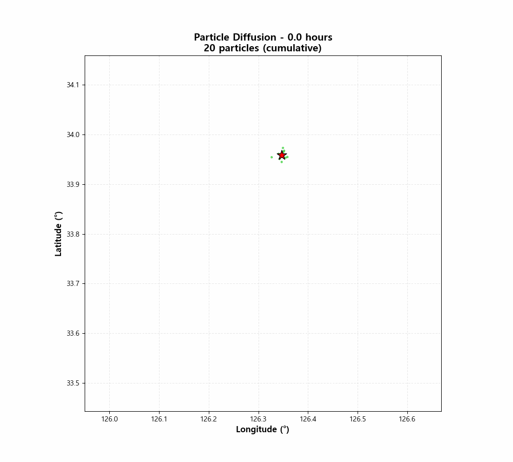

# Two-Stage Metaheuristic Framework for Maritime Search and Rescue (SAR) Resource Allocation

This repository contains the source code and supplementary materials for the paper submitted to **GECCO 2026**.

## 🌊 Particle Diffusion Visualization (Supplementary Material)

Due to the static nature of PDF documents, the time-varying diffusion of particles is presented here. The animation below illustrates the cumulative behavior of shipwreck particles over a 48-hour period .

### Visualization Details
- **Red Star ($\star$)**: Initial Position (Last Known Position)
- **Green Dots ($\bullet$)**: Drifting Particles (Sampled)
- **Time Range**: 0h to 48h

